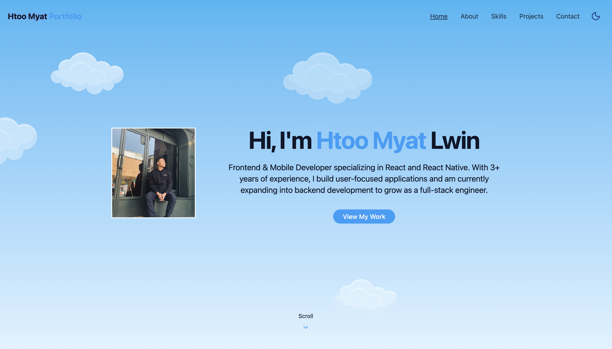
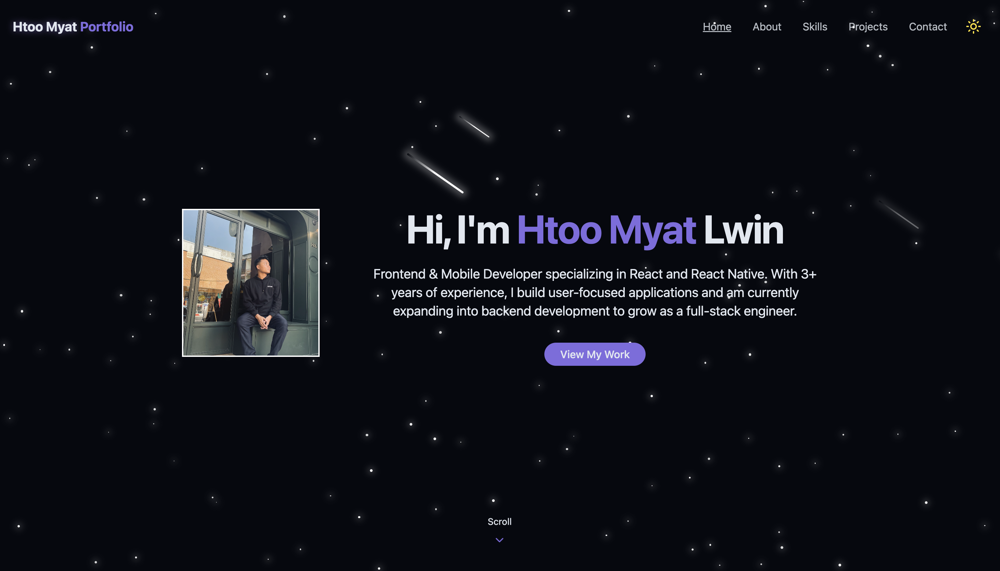

# 🌐 Personal Portfolio Website

A modern, responsive personal portfolio website built to showcase my skills, projects, and professional experience as a developer.

This portfolio highlights my work, technical expertise, and provides an easy way to get in touch through a contact form.

---

## 🚀 Live Demo

👉 https://htoomyatlwin1999-portfolio.vercel.app

---

## 📸 Preview
<p align="center">
  
  
</p>

---

## 🛠️ Tech Stack

- **React** – Component-based UI development
- **Tailwind CSS** – Utility-first CSS framework
- **React Router** – Client-side routing
- **EmailJS** – Contact form email integration
- **Vite / Create React App** – Development & build tooling

---

## ✨ Features

- Fully responsive design (mobile, tablet, desktop)
- Clean and modern UI
- Smooth navigation with React Router
- Contact form powered by EmailJS
- Dark and light mode support
- Reusable and scalable component structure

---

## 📂 Project Structure

```bash
src/
├── components/        # Reusable UI components
├── pages/             # Application pages (Home, About, Projects, Contact)
├── lib /              # utils functions
├── services /         # api Services
├── index.css /        # Global styles
├── App.tsx
└── main.tsx
├── type.tsx
```
